# ImageDeal

[](https://go.dev/)
[](https://react.dev/)
[](https://platform.openai.com/)
[](https://vitejs.dev/)

**SaaS 图片协作平台** + **GPT 智能消除工作室** — CSV 批量入库、多角色领图作图与审核归档，管理端支持 Konva 蒙版 + OpenAI 图像消除 + PSD 导出。

*English summary → [README.en.md](README.en.md)*

---

## 目录

- [核心亮点](#核心亮点)
- [AI 图像消除](#ai-图像消除)
- [团队协作流程](#团队协作流程)
- [快速开始](#快速开始)
- [功能与路由](#功能与路由)
- [UI 设计稿](#ui-设计稿)
- [文档索引](#文档索引)
- [GitHub 展示优化](#github-展示优化)
- [技术栈](#技术栈)
- [联系方式](#联系方式)

---

## 核心亮点

| | |
|---|---|
| **GPT 图像消除** | 画笔蒙版 → OpenAI `gpt-image-2` Inpainting → PNG / PSD 三图层导出 |
| **13 步协作流** | CSV 导入 → 入库分类 → 领图作图 → 一审/二审 → 终稿归档 |
| **多角色 RBAC** | 管理员 / 作图用户 / 审核员，JWT + 路由守卫 |
| **逻辑图库** | 按 `status` 虚拟队列（待分配、任务区、审核队列、终稿库） |
| **异步 Worker** | Redis 队列解析 CSV、批量下载原图与缩略图 |

**本地入口：** 前端 http://localhost:5173 · API http://localhost:8080

---

<a id="ai-图像消除"></a>

## AI 图像消除

> **画笔涂蒙版 → GPT 消除 → 图层对比 → 导出**  
> 管理端 [Canvas 工作室](http://localhost:5173/admin/canvas-studio) · `POST /api/v1/admin/ai/studio-inpaint`

### 实机效果（Before → After）

| 消除人物（沙发场景） | 消除背景牛群（牧场） |
|:---:|:---:|
|  → 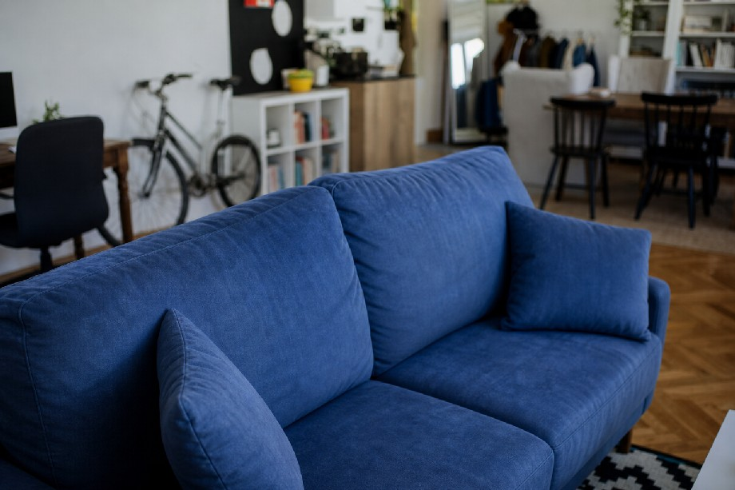 | 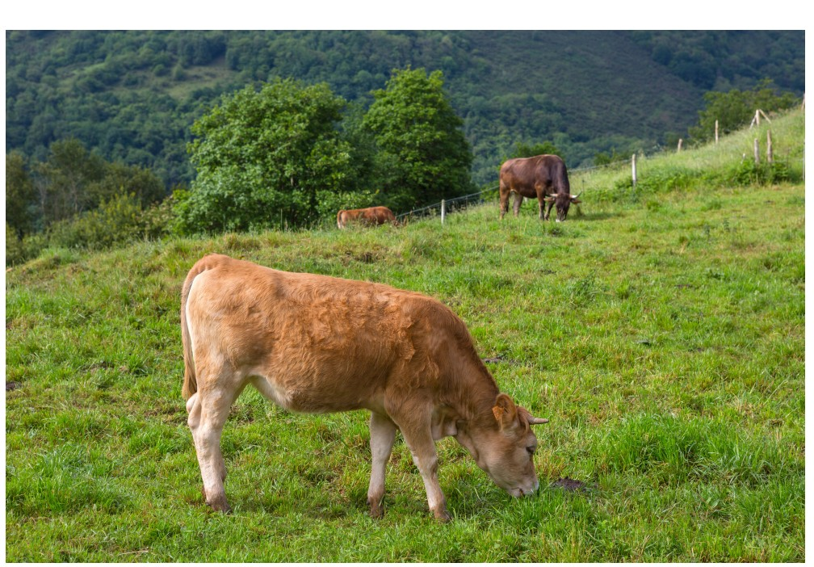 → 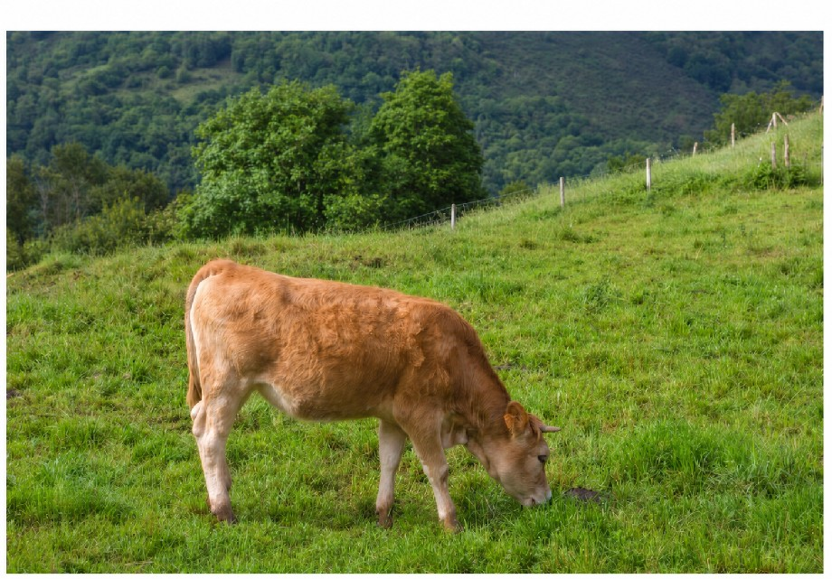 |

*左：原图 · 右：GPT Image 消除后（实机 API 输出）*

### 操作演示（GIF）


*Before/After 切换预览；录制真实操作流程见 [docs/GITHUB-PREVIEW.md](docs/GITHUB-PREVIEW.md)*

### 工作室界面

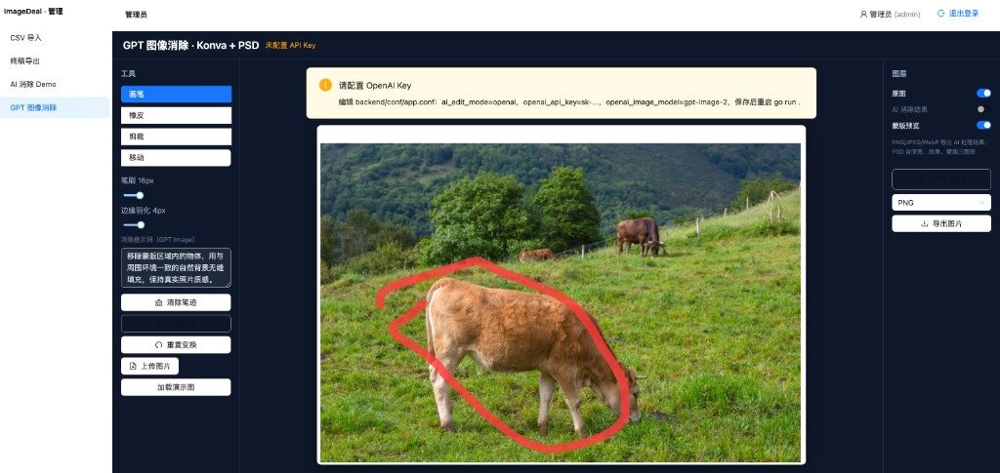

### 能力一览

| 能力 | 说明 |
|------|------|
| 智能消除 | OpenAI GPT Image（`gpt-image-2`，Images Edits API） |
| 蒙版编辑 | Konva 画笔 / 橡皮 / 边缘羽化 / 剪裁 |
| 提示词 | 可自定义消除指令（中文默认已优化） |
| 导出 | PNG · JPEG · WebP；**PSD 三图层**（原图 / AI 结果 / 蒙版） |
| 性能 | 默认 `quality=medium`，长边 ≤ 1024px，通常 20–90 秒/次 |

### 适用场景

- 电商 / 海报素材去杂物、去人物  
- 背景补全与局部重绘  
- 入库前单张精修（与 CSV 协作流配合）

### 30 秒体验

1. `admin@example.com` / `password123` 登录 → 打开 `/admin/canvas-studio`  
2. 在 `backend/conf/app.conf` 配置 `openai_api_key`（勿提交 git）并重启后端  
3. 上传图片 → 红色涂抹要消除区域 → **GPT 消除** → 导出  

```ini
ai_edit_mode = openai
openai_api_key = sk-your-key
openai_image_model = gpt-image-2
```

技术细节：[docs/10-CANVAS-STUDIO.md](docs/10-CANVAS-STUDIO.md) · 旧版 Mock Demo：`/admin/ai-editor` · [docs/09-AI-EDITOR-DEMO.md](docs/09-AI-EDITOR-DEMO.md)

<details>
<summary><b>展开：更多 Demo 对比图</b></summary>

**示例 1 — 消除 1 人 / 全部人物**

| 原图（3 人） | 消除 1 人 | 消除全部 |
|:---:|:---:|:---:|
|  |  |  |

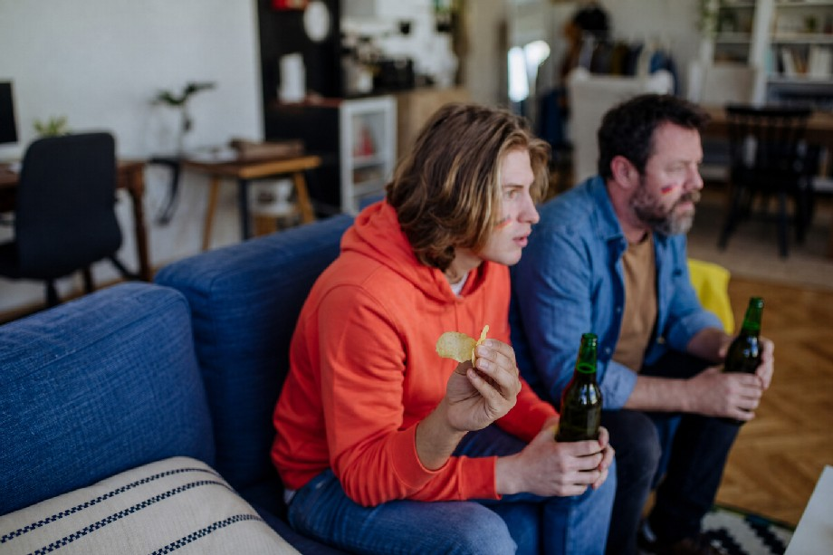

</details>

---

## 团队协作流程

13 步业务闭环：**导入 → 入库 → 分类 → 领图 → 作图 → 提审 → 审核 → 归档**（ImageDeal 自有流程说明）。

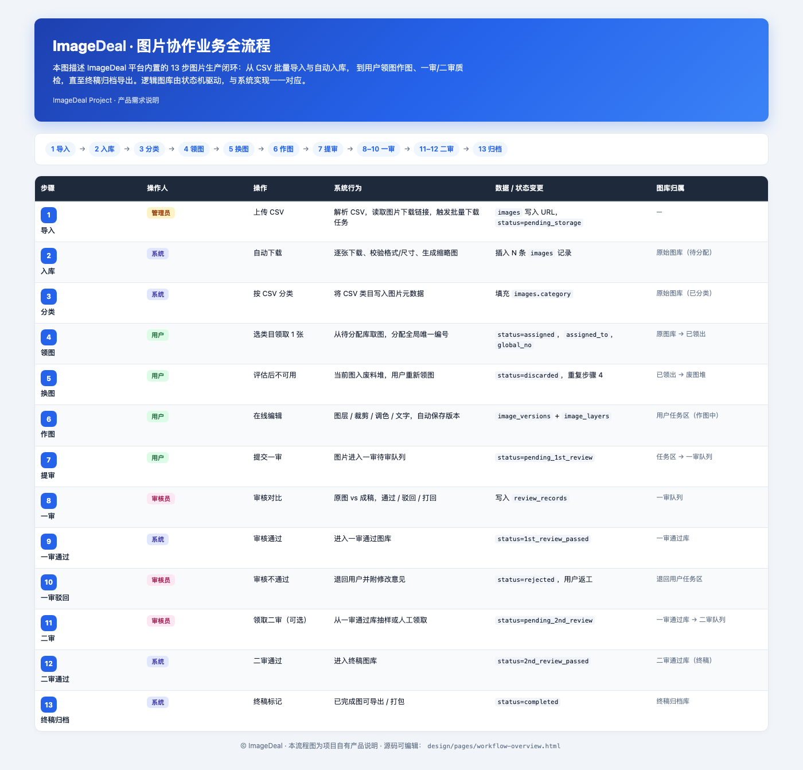

| 步骤 | 角色 | 要点 |
|:---:|------|------|
| 1–3 | 管理员 / 系统 | CSV 导入、下载入库、按类目分类 |
| 4–7 | 用户 | 领图、换图、在线编辑、提交一审 |
| 8–12 | 审核员 | 一审 / 可选二审、通过或驳回 |
| 13 | 系统 / 管理员 | 终稿归档、打包导出 |

**完整需求表、图库定义、状态机** → [docs/REQUIREMENTS.md](docs/REQUIREMENTS.md)

---

## 快速开始

### 环境

```bash
docker compose up -d redis minio   # MySQL 使用本机 127.0.0.1:3306
mysql -h127.0.0.1 -uroot -p123456 -e "CREATE DATABASE IF NOT EXISTS imagedeal ..."
mysql -h127.0.0.1 -uroot -p123456 imagedeal < backend/sql/migrations/001_init.sql
```

| MySQL | `root` / `123456` · 库 `imagedeal` |

### 启动

```bash
# 终端 1 — API
cd backend && go mod tidy && go run .

# 终端 2 — Worker（CSV 解析与图片下载，必开）
cd backend && go run ./worker

# 终端 3 — 前端
cd frontend && npm install && npm run dev
```

| 服务 | 地址 |
|------|------|
| 前端 | http://localhost:5173 |
| API | http://localhost:8080 · `GET /api/v1/health` |
| Canvas 工作室 | http://localhost:5173/admin/canvas-studio |

### 测试账号

密码均为 **`password123`**：

| 邮箱 | 角色 | 入口 |
|------|------|------|
| admin@example.com | admin | `/admin` · Canvas 工作室 |
| user@example.com | user | `/workspace` |
| reviewer@example.com | reviewer | `/review` |

CSV 样例：`backend/sample/`（`import_sample.csv` 等）· 详见 [backend/sample/README.md](backend/sample/README.md)

---

## 功能与路由

| 模块 | 路由 | 说明 |
|------|------|------|
| Admin | `/admin/imports` | CSV 导入与批次 |
| | `/admin/archives` | 终稿导出 |
| | `/admin/canvas-studio` | **GPT 图像消除** |
| | `/admin/ai-editor` | AI Demo（Mock） |
| Workspace | `/workspace/claim` | 领图 |
| | `/workspace/tasks` | 我的任务 |
| | `/workspace/editor/:id` | 在线编辑 |
| Review | `/review/first` · `/review/second` | 一审 / 二审 |
| | `/review/:id` | 原图 vs 成稿对比 |

### 项目结构

```
AIImageDealProject/
├── backend/     # Go API (Beego) + Worker
├── frontend/    # React + Vite + Ant Design
├── design/      # 静态 HTML 设计稿
├── docs/        # 架构与需求文档
└── docker-compose.yml
```

---

## UI 设计稿

静态 HTML 原型（`design/`），本地预览：`open design/index.html` · 说明 [design/README.md](design/README.md)

| 分组 | 页面数 | 代表路由 |
|------|:------:|----------|
| 公共 | 4 | `/login` · `/` · `/403` |
| Admin | 5 | `/admin/imports` · `/admin/canvas-studio` |
| Workspace | 3 | `/workspace/claim` · `/workspace/tasks` |
| Review | 3 | `/review/first` · `/review/:id` |

<details>
<summary><b>展开：UI 设计稿截图（14 屏静态稿 + Canvas 实机）</b></summary>

#### 公共

| 设计稿索引 | 登录 | 工作台首页 | 403 |
|:---:|:---:|:---:|:---:|
| 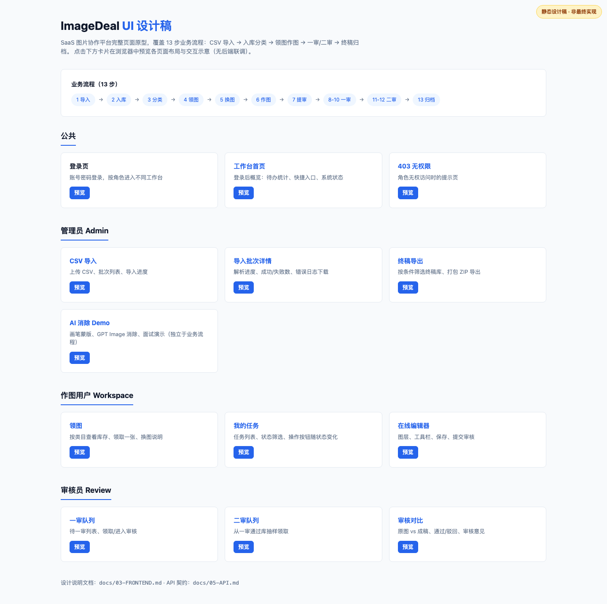 | 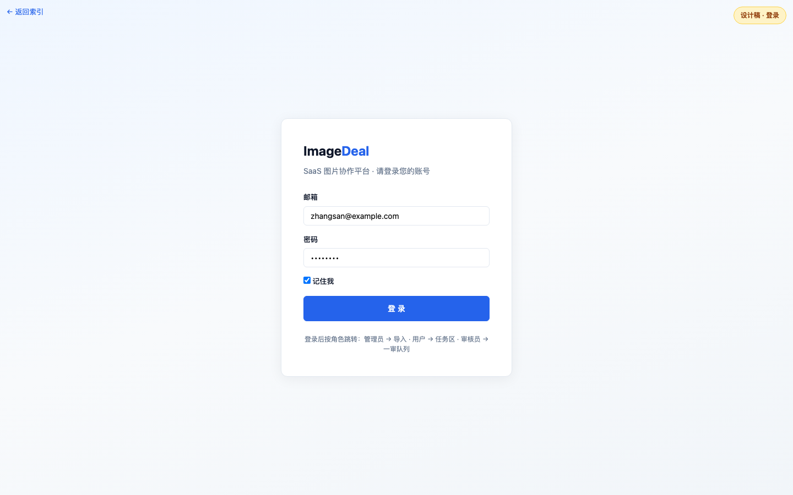 | 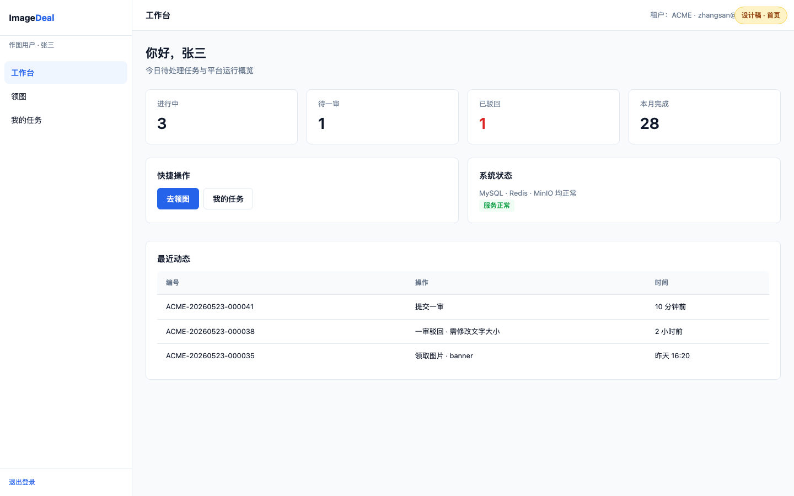 | 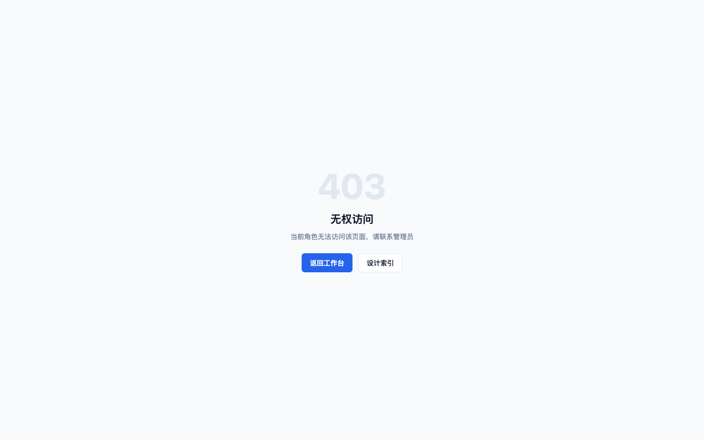 |

#### 管理员

| CSV 导入 | 批次详情 | 终稿导出 | AI Demo | Canvas 工作室 |
|:---:|:---:|:---:|:---:|:---:|
| 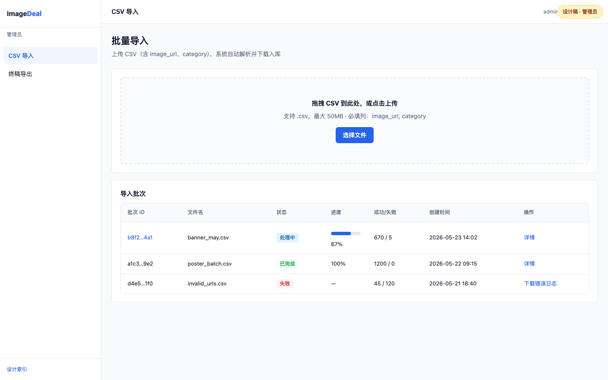 | 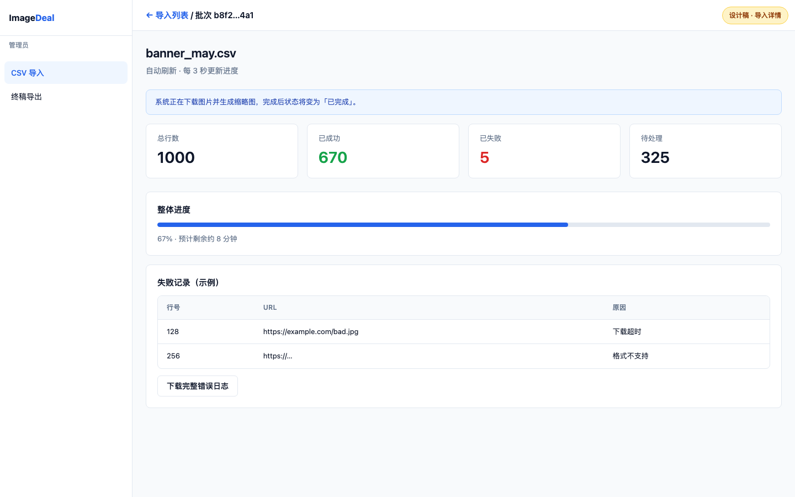 | 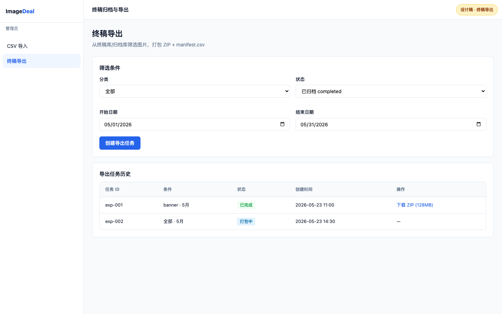 | 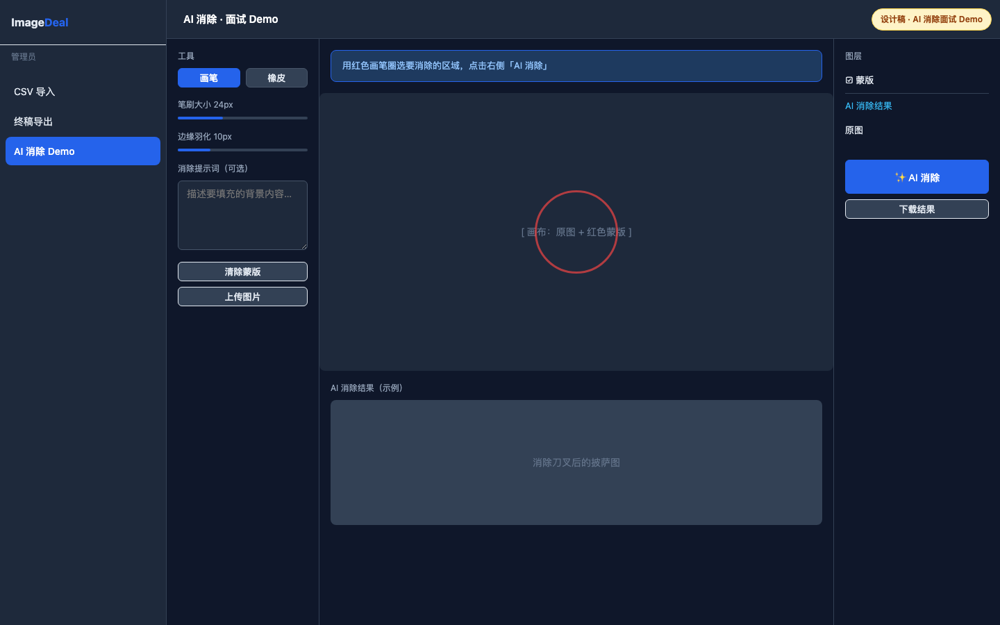 |  |

#### 作图用户

| 领图 | 我的任务 | 在线编辑器 |
|:---:|:---:|:---:|
| 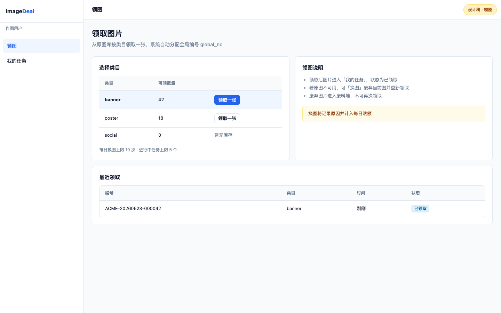 | 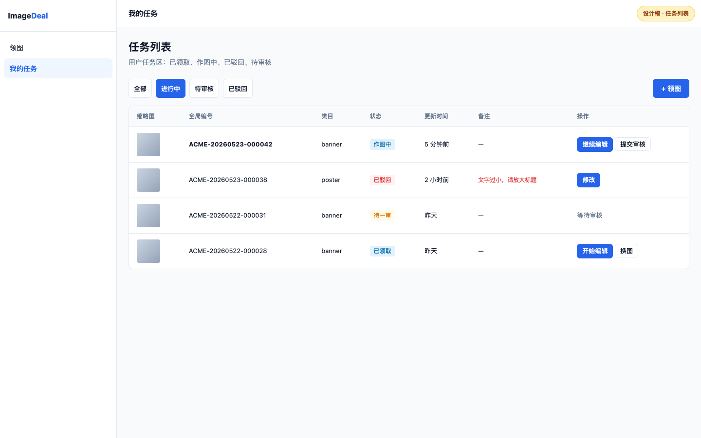 | 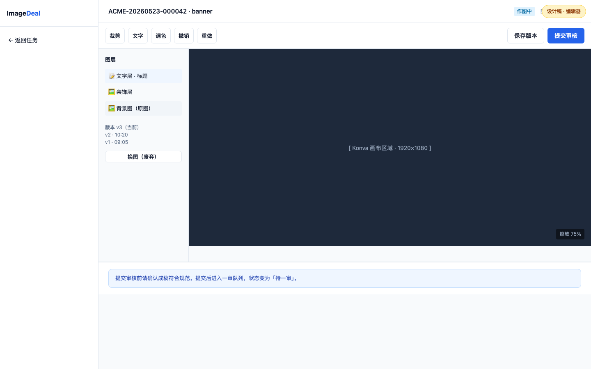 |

#### 审核员

| 一审队列 | 二审队列 | 审核对比 |
|:---:|:---:|:---:|
| 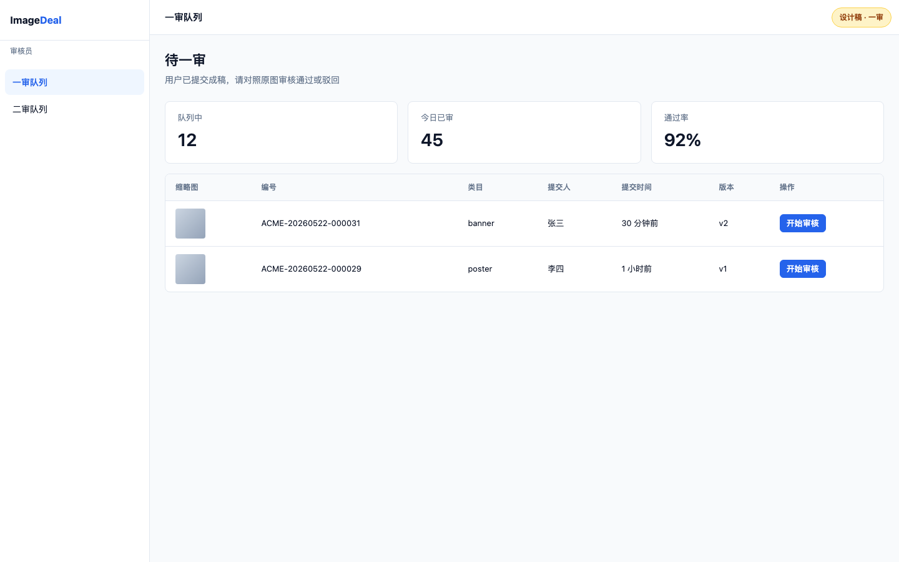 | 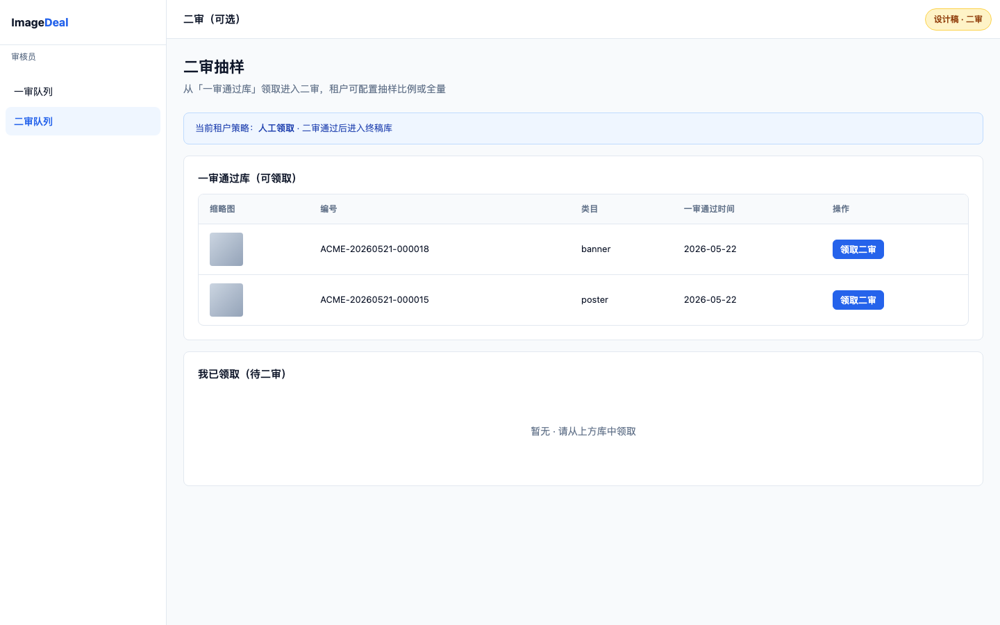 | 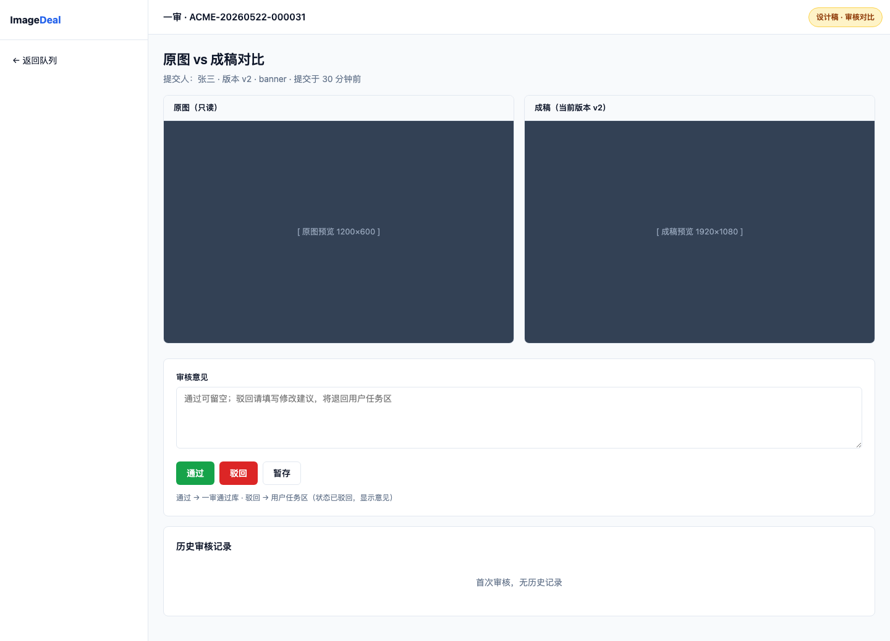 |

</details>

---

## 文档索引

| 文档 | 内容 |
|------|------|
| [docs/REQUIREMENTS.md](docs/REQUIREMENTS.md) | **完整 13 步需求**、图库、状态机 |
| [docs/10-CANVAS-STUDIO.md](docs/10-CANVAS-STUDIO.md) | GPT Canvas 配置与性能 |
| [docs/05-API.md](docs/05-API.md) | REST API |
| [docs/06-STATE-MACHINE.md](docs/06-STATE-MACHINE.md) | 状态流转 |
| [docs/01-OVERVIEW.md](docs/01-OVERVIEW.md) | 架构总览 |
| [docs/07-DEPLOYMENT.md](docs/07-DEPLOYMENT.md) | 部署 |

重新生成设计稿截图：`bash scripts/capture-design-screenshots.sh`

---

## GitHub 展示优化

在 GitHub 上分享仓库时，建议完成以下设置，提升点击率与专业度：

| 项 | 文件 | 操作 |
|----|------|------|
| **Social Preview 封面** | `docs/images/social-preview.png` | 仓库 **Settings → General → Social preview** 上传该图（1280×640） |
| **演示 GIF** | `docs/images/canvas-studio/demo.gif` | 已嵌入 README；可替换为实机录屏 |

一键重新生成封面与 GIF（基于现有 Demo 图）：

```bash
pip3 install Pillow
python3 scripts/generate-readme-assets.py
```

完整说明（含实机录屏步骤）：[docs/GITHUB-PREVIEW.md](docs/GITHUB-PREVIEW.md)

---

## 技术栈

| 层级 | 技术 |
|------|------|
| 后端 | Go · Beego v2 · MySQL 8 · Redis · JWT |
| 前端 | React 19 · TypeScript · Vite · Ant Design · TanStack Query |
| AI | OpenAI GPT Image · Konva · ag-psd |
| 存储 | 本地 `backend/storage/`（MinIO 已预留） |

---

## 联系方式

| | |
|---|---|
| **联系人** | Tim Lu |
| **电话** | 15651616552 |
| **邮箱** | [tim.lu@lianwei.com.cn](mailto:tim.lu@lianwei.com.cn) |
