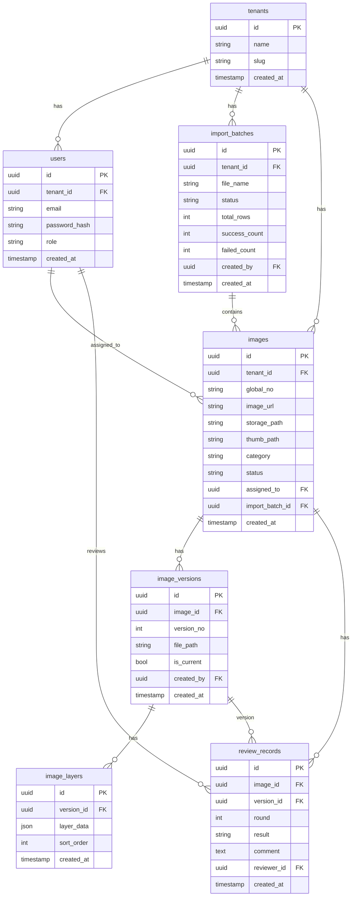

# 数据库设计

> **存储引擎：MySQL 8.0+**  
> 字符集：`utf8mb4`，排序规则：`utf8mb4_unicode_ci`  
> 主键：UUID 存为 `CHAR(36)`（应用层生成，GORM `uuid.UUID` 映射）

---

## 0. MySQL 8 类型映射说明

| 概念 | PostgreSQL（旧） | MySQL 8（本方案） |
|------|------------------|-------------------|
| 主键 UUID | UUID | CHAR(36) |
| JSON 文档 | JSONB | JSON |
| 时间戳 | TIMESTAMPTZ | DATETIME(3) |
| 布尔 | BOOLEAN | TINYINT(1) |
| 部分索引 | `WHERE status = ...` | **不支持**，用联合索引 + 查询条件 |
| 行锁跳过 | SKIP LOCKED | ✅ 8.0.1+ 支持 |

**表引擎：** InnoDB（支持事务、行锁、`FOR UPDATE SKIP LOCKED`）

**连接 DSN 示例：**
```
root:123456@tcp(127.0.0.1:3306)/imagedeal?charset=utf8mb4&parseTime=True&loc=Local
```

---

## 1. ER 关系图



---

## 2. 表结构详细定义

### 2.1 tenants（租户）

| 字段 | 类型 | 约束 | 说明 |
|------|------|------|------|
| id | CHAR(36) | PK | UUID |
| name | VARCHAR(200) | NOT NULL | 租户名称 |
| slug | VARCHAR(50) | UNIQUE | 短标识，用于 global_no 前缀 |
| settings | JSON | | 二审开关、抽样率等，默认 `{}` |
| created_at | DATETIME(3) | NOT NULL | |
| updated_at | DATETIME(3) | NOT NULL | |

### 2.2 users（用户）

| 字段 | 类型 | 约束 | 说明 |
|------|------|------|------|
| id | CHAR(36) | PK | UUID |
| tenant_id | CHAR(36) | FK, NOT NULL | 租户隔离 |
| email | VARCHAR(255) | NOT NULL | |
| password_hash | VARCHAR(255) | NOT NULL | bcrypt |
| display_name | VARCHAR(100) | | 显示名 |
| role | VARCHAR(20) | NOT NULL | admin/user/reviewer |
| is_active | TINYINT(1) | DEFAULT 1 | |
| created_at | DATETIME(3) | NOT NULL | |
| updated_at | DATETIME(3) | NOT NULL | |

**唯一索引：** `UNIQUE (tenant_id, email)`

### 2.3 import_batches（导入批次）

| 字段 | 类型 | 约束 | 说明 |
|------|------|------|------|
| id | CHAR(36) | PK | UUID |
| tenant_id | CHAR(36) | FK, NOT NULL | |
| file_name | VARCHAR(255) | NOT NULL | 原始文件名 |
| storage_path | VARCHAR(500) | | CSV 在 MinIO 的路径 |
| status | VARCHAR(30) | NOT NULL | processing/completed/failed |
| total_rows | INT | DEFAULT 0 | |
| success_count | INT | DEFAULT 0 | |
| failed_count | INT | DEFAULT 0 | |
| error_log | TEXT | | 失败摘要 |
| created_by | CHAR(36) | FK | 上传管理员 |
| created_at | DATETIME(3) | NOT NULL | |
| updated_at | DATETIME(3) | NOT NULL | |

### 2.4 images（图片主表 — 核心）

| 字段 | 类型 | 约束 | 说明 |
|------|------|------|------|
| id | CHAR(36) | PK | UUID |
| tenant_id | CHAR(36) | FK, NOT NULL | |
| global_no | VARCHAR(50) | INDEX | 领图后生成的全局编号 |
| image_url | TEXT | | CSV 原始 URL |
| storage_path | VARCHAR(500) | | MinIO 原图路径 |
| thumb_path | VARCHAR(500) | | 缩略图路径 |
| category | VARCHAR(100) | INDEX | 分类 |
| status | VARCHAR(30) | NOT NULL, INDEX | 状态机 |
| assigned_to | CHAR(36) | FK, INDEX | 当前负责人 |
| import_batch_id | CHAR(36) | FK | 来源批次 |
| external_id | VARCHAR(100) | | CSV 外部 ID |
| metadata | JSON | | 扩展：尺寸、格式、tags |
| discard_reason | TEXT | | 换图原因 |
| created_at | DATETIME(3) | NOT NULL | |
| updated_at | DATETIME(3) | NOT NULL | |

**关键索引（MySQL 联合索引，无部分索引）：**
```sql
-- 领图：WHERE tenant_id=? AND status='pending_assign' AND category=? ORDER BY created_at
CREATE INDEX idx_images_claim ON images (tenant_id, status, category, created_at);

-- 任务区：WHERE tenant_id=? AND assigned_to=? AND status IN (...)
CREATE INDEX idx_images_tasks ON images (tenant_id, assigned_to, status);

-- 审核队列：WHERE tenant_id=? AND status IN ('pending_1st_review','pending_2nd_review')
CREATE INDEX idx_images_review ON images (tenant_id, status);
```

### 2.5 image_versions（版本）

| 字段 | 类型 | 约束 | 说明 |
|------|------|------|------|
| id | CHAR(36) | PK | UUID |
| image_id | CHAR(36) | FK, NOT NULL | |
| version_no | INT | NOT NULL | 递增 |
| file_path | VARCHAR(500) | | 渲染后成稿路径 |
| is_current | TINYINT(1) | DEFAULT 0 | 当前生效版本 |
| created_by | CHAR(36) | FK | |
| created_at | DATETIME(3) | NOT NULL | |

**唯一索引：** `UNIQUE (image_id, version_no)`

### 2.6 image_layers（图层）

| 字段 | 类型 | 约束 | 说明 |
|------|------|------|------|
| id | CHAR(36) | PK | UUID |
| version_id | CHAR(36) | FK, NOT NULL | |
| layer_data | JSON | NOT NULL | Konva 图层 JSON |
| sort_order | INT | DEFAULT 0 | |
| created_at | DATETIME(3) | NOT NULL | |

### 2.7 review_records（审核记录）

| 字段 | 类型 | 约束 | 说明 |
|------|------|------|------|
| id | CHAR(36) | PK | UUID |
| image_id | CHAR(36) | FK, NOT NULL | |
| version_id | CHAR(36) | FK | 被审版本 |
| round | INT | NOT NULL | 1=一审, 2=二审 |
| result | VARCHAR(20) | NOT NULL | pass/reject |
| comment | TEXT | | 审核意见 |
| reviewer_id | CHAR(36) | FK, NOT NULL | |
| created_at | DATETIME(3) | NOT NULL | |

### 2.8 audit_logs（操作审计，可选）

| 字段 | 类型 | 说明 |
|------|------|------|
| id | CHAR(36) | PK |
| tenant_id | CHAR(36) | |
| user_id | CHAR(36) | 操作人 |
| action | VARCHAR(50) | claim/discard/submit/review |
| resource_type | VARCHAR(30) | image |
| resource_id | CHAR(36) | |
| payload | JSON | 变更快照 |
| created_at | DATETIME(3) | |

---

## 3. 状态字段枚举

`images.status` 完整取值见 [06-STATE-MACHINE.md](./06-STATE-MACHINE.md)

---

## 4. 租户 settings JSON 示例

```json
{
  "second_review_enabled": true,
  "second_review_sample_rate": 0.1,
  "max_discard_per_day": 10,
  "allowed_image_types": ["jpeg", "png", "webp"],
  "max_image_size_mb": 20
}
```

---

## 5. 迁移策略

- 使用 **golang-migrate**（`mysql` driver）或 **Goose** 管理版本化 SQL
- 文件名：`000001_init.up.sql` / `000001_init.down.sql`
- 生产：CI 部署前自动 migrate；禁止依赖 GORM AutoMigrate
- 建库语句：`CREATE DATABASE imagedeal CHARACTER SET utf8mb4 COLLATE utf8mb4_unicode_ci;`

---

## 6. 数据量与分区（远期）

| 表 | 预估量级 | 策略 |
|----|----------|------|
| images | 百万级/租户 | 按 tenant_id 分库或 MySQL 分区表 |
| image_versions | 数倍于 images | 定期归档冷数据 |
| review_records | 与 images 同级 | 与 images 同生命周期 |

---

## 7. 备份与恢复

- MySQL：每日全量备份 + binlog 增量（ROW 格式）
- MinIO/OSS：跨区域复制
- 恢复演练：季度一次
