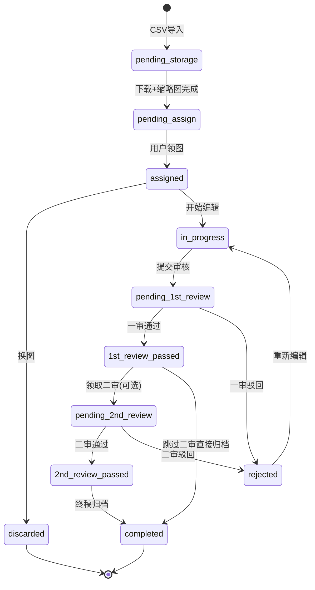

# 状态机与业务流程

---

## 1. 状态一览

| 状态值 | 中文 | 所属图库 |
|--------|------|----------|
| `pending_storage` | 待入库 | —（系统处理中） |
| `pending_assign` | 待分配 | 原图库 |
| `assigned` | 已领取 | 用户任务区 |
| `discarded` | 已废弃 | 废料堆 |
| `in_progress` | 作图中 | 用户任务区 |
| `pending_1st_review` | 待一审 | 一审队列 |
| `rejected` | 一审驳回 | 用户任务区 |
| `1st_review_passed` | 一审通过 | 一审通过库 |
| `pending_2nd_review` | 待二审 | 二审队列 |
| `2nd_review_passed` | 二审通过 | 终稿库 |
| `completed` | 已归档 | 终稿归档库 |

---

## 2. 状态流转图



---

## 3. 13 步业务流程映射

| 步骤 | 操作人 | 触发动作 | 状态变更 |
|------|--------|----------|----------|
| 1 导入 | Admin | 上传 CSV | 创建 batch；images 写入 URL，status=pending_storage |
| 2 入库 | System | 下载校验 | pending_storage → pending_assign |
| 3 分类 | System | 写 category | 保持 pending_assign |
| 4 领图 | User | claim | pending_assign → assigned |
| 5 换图 | User | discard | assigned → discarded；用户重新领图 |
| 6 作图 | User | start-editing / save | assigned → in_progress |
| 7 提审 | User | submit | in_progress → pending_1st_review |
| 8 一审 | Reviewer | review | 写 review_records |
| 9 一审通过 | System | pass | pending_1st_review → 1st_review_passed |
| 10 一审驳回 | Reviewer | reject | pending_1st_review → rejected |
| 11 二审 | Reviewer | claim-second | 1st_review_passed → pending_2nd_review |
| 12 二审通过 | System | pass | pending_2nd_review → 2nd_review_passed |
| 13 归档 | System/Admin | complete | 2nd_review_passed → completed |

---

## 4. 合法转换表（Service 层校验）

实现为 `map[ImageStatus][]ImageStatus` 或显式 switch：

| 当前状态 | 允许的目标状态 | 触发方法 |
|----------|----------------|----------|
| pending_storage | pending_assign | Worker:DownloadComplete |
| pending_assign | assigned | ClaimImage |
| assigned | discarded | DiscardImage |
| assigned | in_progress | StartEditing |
| in_progress | pending_1st_review | SubmitForReview |
| pending_1st_review | 1st_review_passed | Submit1stReview(pass) |
| pending_1st_review | rejected | Submit1stReview(reject) |
| rejected | in_progress | StartEditing |
| 1st_review_passed | pending_2nd_review | ClaimSecondReview |
| 1st_review_passed | completed | CompleteArchive（二审关闭时） |
| pending_2nd_review | 2nd_review_passed | Submit2ndReview(pass) |
| pending_2nd_review | rejected | Submit2ndReview(reject) |
| 2nd_review_passed | completed | CompleteArchive |

**非法转换示例：** `pending_assign` 直接 → `pending_1st_review` ❌

---

## 5. 并发与一致性

### 5.1 领图（关键路径）

- **机制：** MySQL 8 `SELECT ... FOR UPDATE SKIP LOCKED`（8.0.1+）
- **保证：** 一张图同一时刻只会被一个事务领取
- **失败：** 无可用行 → `NO_IMAGE_AVAILABLE`

### 5.2 提审

- 校验 `assigned_to == current_user`
- 校验存在 `is_current=true` 的版本
- 事务内：改 status + 可选锁版本

### 5.3 审核

- 校验 status 与 round 匹配
- 同一 image + round 不可重复 pass（幂等）

### 5.4 换图限制

- 租户 settings：`max_discard_per_day`
- Redis 计数：`discard:{tenant}:{user}:{date}` TTL 24h

---

## 6. 二审策略

| 模式 | 配置 | 行为 |
|------|------|------|
| 关闭 | second_review_enabled=false | 一审通过 → 可直接 completed |
| 全量 | sample_rate=1.0 | 全部进入二审 |
| 抽样 | sample_rate=0.1 | 一审通过时 10% 自动 pending_2nd_review，其余 completed |
| 人工领取 | manual=true | 审核员从通过库主动 claim |

**推荐 MVP：** 人工领取模式，灵活且易理解。

---

## 7. 业务规则补充

| 规则 | 建议默认值 |
|------|------------|
| 用户同时进行中任务数上限 | 5 |
| 每日换图上限 | 10 |
| 驳回后是否必须换版本号提审 | 是 |
| 废料堆是否可恢复 | 否（Admin 可手动） |
| global_no 生成时机 | 领图成功时 |
| 一审驳回是否保留 assigned_to | 是，原用户返工 |

---

## 8. 审计事件

每次状态变更建议写 `audit_logs`：

```json
{
  "action": "status_change",
  "from": "in_progress",
  "to": "pending_1st_review",
  "operator_id": "user-uuid",
  "image_id": "image-uuid"
}
```

便于排查「谁在何时改了什么状态」。
