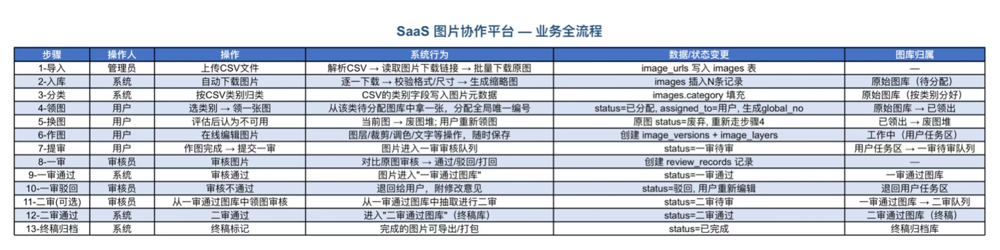

# ImageDeal — 项目需求说明

> 完整业务流程与实现对照。README 为产品首页，本文档供产品评审与开发对齐。

[← 返回 README](../README.md)

---

## 业务背景

平台解决 **大批量外链图片素材** 在团队内的协作生产问题：

- 管理员通过 CSV 批量导入图片 URL 与分类
- 系统自动下载、校验、生成缩略图并分类入库
- 用户按类目领图、在线编辑、提交审核
- 审核员一审（可选二审）进行质量控制
- 通过后进入终稿库，支持导出打包

核心驱动：**图片状态机** + **逻辑图库（虚拟队列）** + **多角色 RBAC**。

## 业务流程总图（13 步）

## 13 步需求明细

| 步骤 | 操作人 | 操作 | 系统行为 | 数据/状态变更 | 图库归属 |
|:---:|--------|------|----------|---------------|----------|
| **1 导入** | 管理员 | 上传 CSV | 解析 CSV，读取图片下载链接，批量下载原图 | `image_urls` 写入 `images` 表 | — |
| **2 入库** | 系统 | 自动下载 | 逐张下载、校验格式/尺寸、生成缩略图 | 插入 N 条 `images` 记录 | 原始图库（待分配） |
| **3 分类** | 系统 | 按 CSV 分类 | 将 CSV 类目写入图片元数据 | 填充 `images.category` | 原始图库（按类别分好） |
| **4 领图** | 用户 | 选类目领取 1 张 | 从该类目待分配库取 1 张，分配全局唯一编号 | `status=已分配`，`assigned_to=用户`，生成 `global_no` | 原始图库 → 已领出 |
| **5 换图** | 用户 | 评估后不可用 | 当前图入废料堆，用户重新领图 | 原图 `status=废弃`；重复步骤 4 | 已领出 → 废图堆 |
| **6 作图** | 用户 | 在线编辑 | 图层/裁剪/调色/文字等，保存进度 | 创建 `image_versions` + `image_layers` | 工作中（用户任务区） |
| **7 提审** | 用户 | 编辑完成提交一审 | 图片进入一审队列 | `status=一审待审` | 用户任务区 → 一审待审队列 |
| **8 一审** | 审核员 | 审核 | 对比原图，通过/驳回/打回修改 | 写入 `review_records` | 一审队列 |
| **9 一审通过** | 系统 | 审核通过 | 进入「一审通过图库」 | `status=一审通过` | 一审通过图库 |
| **10 一审驳回** | 审核员 | 审核不通过 | 退回用户并附修改意见 | `status=驳回`；用户重新编辑 | 退回用户任务区 |
| **11 二审（可选）** | 审核员 | 从一审通过库领取二审 | 抽样或人工领取 | `status=二审待审` | 一审通过图库 → 二审队列 |
| **12 二审通过** | 系统 | 二审通过 | 进入「二审通过图库（终稿）」 | `status=二审通过` | 二审通过图库（终稿） |
| **13 终稿归档** | 系统 | 终稿标记 | 已完成图可导出/打包 | `status=已完成` | 终稿归档库 |

## 角色与权限

| 功能 | Admin | User | Reviewer | System |
|------|:-----:|:----:|:--------:|:------:|
| CSV 导入 / 查看批次 | ✅ | — | — | — |
| 按类目领图 / 换图 | — | ✅ | — | — |
| 在线编辑 / 保存版本 / 提审 | — | ✅ | — | — |
| 一审 / 二审审核 | — | — | ✅ | — |
| 终稿导出 | ✅ | — | — | — |
| 批量下载 / 缩略图 | — | — | — | ✅ |
| GPT 图像消除（Canvas 工作室） | ✅ | — | — | — |

## 逻辑图库（虚拟队列）

| 图库名称 | 过滤条件 | 可见角色 |
|----------|----------|----------|
| 原图库（待分配） | `pending_assign` | User |
| 原图库（已分类） | `pending_assign` + `category` | User |
| 已领取 / 用户任务区 | `assigned_to = me`，status 含 assigned / in_progress / rejected | User |
| 废料堆 | `discarded` | Admin |
| 一审队列 | `pending_1st_review` | Reviewer |
| 一审通过库 | `1st_review_passed` | Reviewer、Admin |
| 二审队列 | `pending_2nd_review` | Reviewer |
| 终稿库 | `2nd_review_passed` / `completed` | Admin |

## 功能模块拆分

| 模块 | 路由前缀 | 主要页面 | 对应步骤 |
|------|----------|----------|----------|
| **管理端 Admin** | `/admin` | CSV 导入、批次详情、终稿导出、AI Demo、Canvas 工作室 | 1、13；AI 扩展 |
| **工作台 Workspace** | `/workspace` | 领图、我的任务、在线编辑器 | 4–7 |
| **审核端 Review** | `/review` | 一审队列、二审队列、审核对比 | 8–12 |
| **认证** | `/login` | 登录、403 | 全角色 |

## 状态机（实现对照）

| 状态值 | 中文 | 所属图库 |
|--------|------|----------|
| `pending_storage` | 待入库 | 系统处理中 |
| `pending_assign` | 待分配 | 原图库 |
| `assigned` / `in_progress` | 已领取 / 作图中 | 用户任务区 |
| `discarded` | 已废弃 | 废料堆 |
| `pending_1st_review` | 待一审 | 一审队列 |
| `rejected` | 一审驳回 | 用户任务区 |
| `1st_review_passed` | 一审通过 | 一审通过库 |
| `pending_2nd_review` | 待二审 | 二审队列 |
| `2nd_review_passed` | 二审通过 | 终稿库 |
| `completed` | 已归档 | 终稿归档库 |

详见 [06-STATE-MACHINE.md](./06-STATE-MACHINE.md)。

## 业务规则（默认）

| 规则 | 默认值 |
|------|--------|
| 用户同时进行中任务上限 | 5 |
| 每日换图上限 | 10（Redis 计数） |
| 领图并发 | `FOR UPDATE SKIP LOCKED` |
| 二审模式 | 人工从一审通过库领取（MVP） |
| `global_no` 生成时机 | 领图成功时 |

## 需求 ↔ 实现索引

| 步骤 | API / 组件要点 |
|------|----------------|
| 1 导入 | `POST /api/v1/imports` + Redis `parse_csv` |
| 2–3 入库/分类 | Worker `download` → `storage/originals/` |
| 4 领图 | `POST /images/claim` |
| 5 换图 | `POST /images/:id/discard` |
| 6 作图 | `PUT /images/:id/versions` |
| 7 提审 | `POST /images/:id/submit` |
| 8–12 审核 | `POST /images/:id/reviews`；`POST /reviews/claim-second` |
| 13 归档 | `GET /archives`；`POST /archives/:id/complete` |

## 扩展：GPT 图像消除

Canvas 工作室（`/admin/canvas-studio`）不纳入主流程状态机，详见 [10-CANVAS-STUDIO.md](./10-CANVAS-STUDIO.md) 与 README AI 专节。

## 相关文档

- [01-OVERVIEW.md](./01-OVERVIEW.md) — 架构总览
- [05-API.md](./05-API.md) — REST API
- [03-FRONTEND.md](./03-FRONTEND.md) — 前端路由与交互
